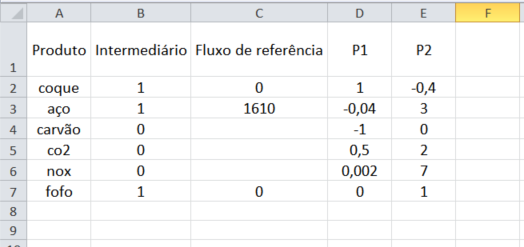
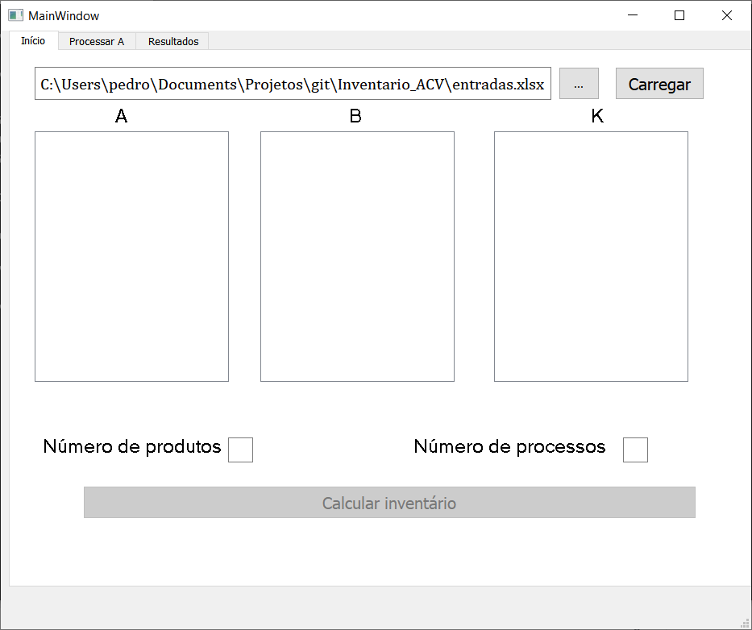
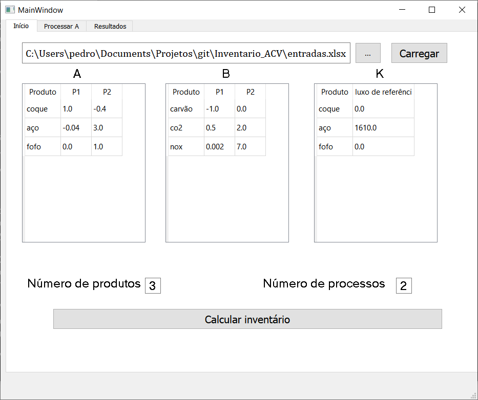
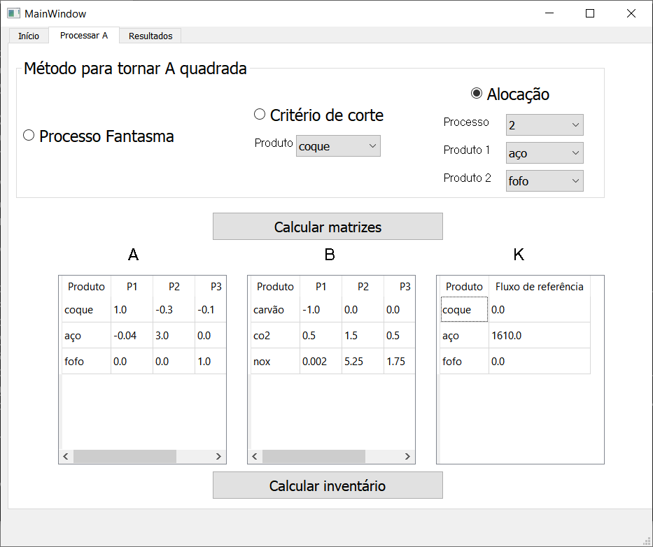
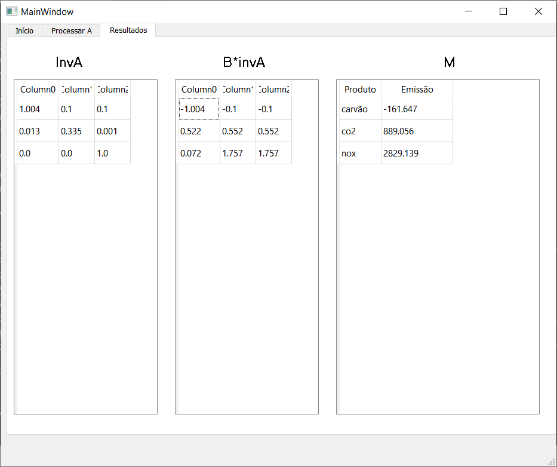

# Inventario_ACV
Calcula o inventário de uma Análise do Ciclo de Vida de um produto

# Exemplo de tabela de entrada

# Exemplo de utilização
## Tela Inicial

## Carregamento dos dados

## Tornando A inversível
Aqui foi utilizada uma alocação no processo 2, entre aço e fofo

## Resultados

